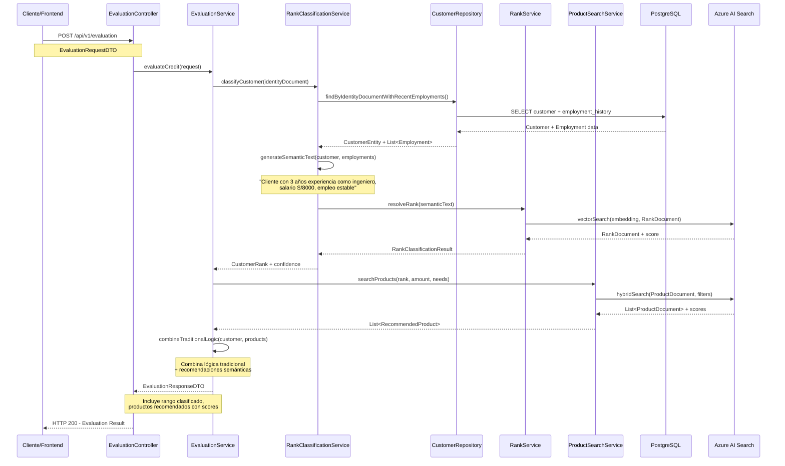

# Backlog: POC Búsquedas Semánticas Simple con Azure AI Search

## 📋 Resumen Ejecutivo - POC SIMPLE

POC para demostrar búsquedas semánticas en evaluación crediticia:
1. **Clasificación de Rangos**: Cliente en BD → historial empleo → query semántico → rango  
2. **Sincronización Productos**: Productos BD → AI Search automáticamente
3. **Evaluación Mejorada**: Cliente → rango semántico → productos apropiados de AI Search

**IMPORTANTE**: No tocar entidades Customer existentes, usar BD relacional tal como está.

---

## 🎯 Objetivos

- [ ] Buscar cliente en BD relacional y clasificar su rango semánticamente
- [ ] Sincronizar productos automáticamente a AI Search cuando se guarden  
- [ ] Integrar búsqueda semántica en evaluación: cliente → rango → productos

---

## 📦 TAREA 0: Simplificar DTOs Existentes (REQUERIDO)
**⏱️ Estimado: 1 hora**

### 🎯 Objetivo  
Simplificar EvaluationRequestDTO eliminando campos redundantes que ya existen en CustomerEntity BD.

### ✅ Criterios de Aceptación
- [ ] EvaluationRequestDTO solo tenga: identityDocument + requestedAmount
- [ ] Eliminar AdditionalInfoDTO completo (monthlyIncome, currentDebt, creditScore, employmentType)
- [ ] Mantener endpoint POST /products/evaluate funcionando
- [ ] Los datos eliminados se obtendrán de CustomerEntity en BD

### 🔧 Tareas Específicas
1. **Simplificar EvaluationRequestDTO** - Reducir campos a mínimos:
   - Solo identityDocument (ya existe)
   - Solo requestedAmount (ya existe)  
   - Eliminar requestedCurrency (usar default S/)
   - Eliminar category (se inferirá)
   - Eliminar todo AdditionalInfoDTO

2. **Actualizar EvaluationController** - Mantener endpoint actual:
   - POST /products/evaluate (sin cambio de ruta)
   - Mismo behavior pero con request simplificado

### 📁 Archivos a Modificar
- `EvaluationRequestDTO.java` (simplificar)
- `EvaluationController.java` (documentación)

---

## 📦 TAREA 1: Clasificación Semántica de Rangos por Cliente
**⏱️ Estimado: 3 horas**

### 🎯 Objetivo  
Integrar clasificación semántica en EvaluationService usando datos de BD + AI Search.

### ✅ Criterios de Aceptación
- [ ] EvaluationService busque cliente en BD con historial empleo
- [ ] Genera texto semántico del perfil laboral del cliente
- [ ] Usa RankService existente para clasificar rango con AI Search
- [ ] Integra rango clasificado en respuesta de evaluación

### 🔧 Tareas Específicas
1. **Implementar EvaluationServiceImpl** - Completar método vacío:
   - Use CustomerRepository.findByIdentityDocumentWithRecentEmployments()
   - Genere texto descriptivo del historial laboral
   - Llame al RankService.resolveRank() existente
   - Maneje casos edge (cliente no encontrado, sin historial)

2. **Enriquecer EvaluationResponseDTO** - Agregar campos semánticos:
   - Rango clasificado en clientProfile
   - Score de confianza de clasificación
   - Descripción semántica utilizada

### 📁 Archivos a Crear/Modificar
- `EvaluationServiceImpl.java` (implementar método vacío)
- `EvaluationResponseDTO.java` (agregar campos rango)

### 🔄 Flujo
```
1. POST /products/evaluate (identityDocument: 72456789, requestedAmount: 50000)
2. CustomerRepository.findByIdentityDocumentWithRecentEmployments(72456789)
3. Generar texto: "Cliente con 3 años experiencia como ingeniero, salario S/8000, empleo estable"
4. RankService.resolveRank(texto) → clasifica con AI Search
5. Return EvaluationResponse con rango + productos tradicionales
```

---

## 📦 TAREA 2: Sincronización Automática Productos → AI Search  
**⏱️ Estimado: 3 horas**

### 🎯 Objetivo
Listener JPA que cuando se guarde/modifique un producto en BD, automáticamente lo indexe en AI Search.

### ✅ Criterios de Aceptación  
- [ ] Eventos automáticos en CreditProductEntity (@PostPersist, @PostUpdate, @PostRemove)
- [ ] Conversión automática CreditProductEntity → ProductDocument
- [ ] Generación de embeddings para campos de texto del producto
- [ ] Indexación asíncrona en AI Search sin bloquear operación principal

### 🔧 Tareas Específicas
1. **Crear ProductSyncListener** - JPA Entity Listener que:
   - Se ejecute automáticamente en CRUD operations
   - Convierta entity a ProductDocument
   - Genere embeddings para description, features, benefits
   - Indexe en AI Search de forma asíncrona

2. **Crear ProductDocumentMapper** - Mapper simple que:
   - Mapee todos los campos de CreditProductEntity → ProductDocument
   - Use OpenAI para generar embeddings
   - Combine description + features + benefits en texto para embedding

### 📁 Archivos a Crear/Modificar
- `ProductSyncListener.java` 
- `ProductDocumentMapper.java`
- `CreditProductEntity.java` (solo agregar @EntityListeners)

---

## 📦 TAREA 3: Integrar Búsqueda Semántica en Evaluación  
**⏱️ Estimado: 3 horas**

### 🎯 Objetivo
Mejorar EvaluationService para buscar productos en AI Search filtrados por rango semántico.

### ✅ Criterios de Aceptación
- [ ] EvaluationService busque productos en AI Search filtrados por rango
- [ ] Combine resultados de BD tradicional + AI Search semántico  
- [ ] Performance < 2 segundos
- [ ] Mantenga endpoint POST /products/evaluate

### 🔧 Tareas Específicas
1. **Crear ProductSearchService** - Búsqueda semántica en AI Search:
   - Use productSearchClient existente
   - Filtros: allowedRanks contiene rango + minimumAmount <= monto <= maximumAmount
   - Retorne productos ordenados por relevancia semántica

2. **Mejorar EvaluationServiceImpl** - Combinar ambas fuentes:
   - Productos de BD tradicional (CreditProductRepository.findEligibleProducts)
   - Productos de AI Search (ProductSearchService)
   - Merge y ranking híbrido de productos

### 📁 Archivos a Crear/Modificar  
- `ProductSearchService.java` (crear)
- `EvaluationServiceImpl.java` (mejorar)

---

## 📊 Estimación Total: 10 horas (1.25 días)

### 📅 Plan de Implementación
- **Mañana**: Tarea 1 (4h) - Clasificación de rangos
- **Tarde**: Tarea 2 (3h) - Sincronización productos  
- **Siguiente día**: Tarea 3 (4h) - Integración evaluación

---

## 🔑 Decisiones de Diseño - SIMPLE

### ✅ Lo que SÍ vamos a hacer
- Usar RankDocument y ProductDocument existentes
- Usar CustomerRepository y métodos existentes
- Mejorar RankService que ya funciona
- Usar SearchClient beans ya configurados
- Aprovechar OpenAI client existente

### ❌ Lo que NO vamos a hacer
- Crear nuevos servicios complejos
- Modificar entidades Customer existentes
- Crear APIs adicionales complejas
- Implementar caching avanzado
- Crear configuraciones complejas

---

## 🎯 Flujo Final de la POC



**1. EvaluationService implementado pero VACÍO** �  
```json
// ENDPOINT ACTUAL: POST /products/evaluate
{
  "identityDocument": "72456789",
  "requestedAmount": 50000,
  "requestedCurrency": "S/",
  "additionalInfo": {
    "monthlyIncome": 8500,
    "currentDebt": 2000,
    "creditScore": 750,
    "employmentType": "Dependiente"  
  }
}
```
**PROBLEMA**: EvaluationServiceImpl.evaluateClientEligibility() está **VACÍO** - método sin implementar.

**2. EvaluationRequestDTO tiene campos REDUNDANTES** ⚠️  
Los campos additionalInfo ya existen en CustomerEntity:
- monthlyIncome → CustomerEntity.monthlyIncome  
- currentDebt → CustomerEntity.currentDebt
- creditScore → Se puede calcular
- employmentType → Se puede inferir de EmploymentHistoryEntity

**3. Request simplificado propuesto** ✅
```json
// NUEVO REQUEST SIMPLIFICADO:
{
  "identityDocument": "72456789", 
  "requestedAmount": 50000
}
```
Los demás datos se obtendrán de CustomerEntity con CustomerRepository.findByIdentityDocumentWithRecentEmployments()

**4. MANTENER endpoint POST /products/evaluate** 📌  
NO crear nuevos endpoints - usar la implementación existente pero mejorada.

### 📝 Ejemplo Paso a Paso con Datos Ficticios (ACTUALIZADO):

**1. Cliente solicita evaluación crediticia** 📞
```json
POST /products/evaluate
{
  "identityDocument": "72456789",
  "requestedAmount": 50000
}
```

**2. Sistema busca cliente en BD relacional** �  
EvaluationServiceImpl llama:
```java
CustomerEntity customer = customerRepository
    .findByIdentityDocumentWithRecentEmployments("72456789");
// Obtiene: Customer + 2 empleos más recientes automáticamente
```

**3. Genera texto semántico del historial laboral** 📝
```java
// En EvaluationServiceImpl:
String semanticText = generateSemanticProfile(customer);
// Resultado: "Profesional de tecnología con 4.3 años experiencia..."
```

**4. AI Search clasifica el rango del cliente** 🤖
```java 
// EvaluationServiceImpl usa RankService existente:
RankDocument rank = rankService.resolveRank(semanticText);
// Resultado: RANGO_PLATA (score: 0.87)
```

**5. Busca productos apropiados** 🎯
```java
// Combina BD tradicional + AI Search:
List<CreditProductEntity> traditionalProducts = creditProductRepository
    .findEligibleProducts(50000, "S/", null);
List<ProductDocument> semanticProducts = productSearchService
    .searchByRankAndAmount("PLATA", 50000);
```

**6. Combina resultados** ⚖️
```java
// En EvaluationServiceImpl - método a implementar:
EvaluationResponseDTO response = combineTraditionalAndSemanticResults(
    traditional, semantic, customer, rank);
```

**7. Retorna evaluación enriquecida** ✅
```json
// RESPONSE (usando DTOs existentes enriquecidos):
{
  "clientProfile": {
    "identityDocument": "72456789",
    "creditScore": 750,
    "riskLevel": "PLATA", // <- NUEVO: rango semántico  
    "approvedAmount": 45000,
    "semanticConfidence": 0.87 // <- NUEVO: confianza IA
  },
  "eligibleProducts": [...], // Productos tradicionales + semánticos
  "summary": {
    "totalEligibleProducts": 3,
    "bestOption": {...}
  }
}
```

### Flujo Final REAL (usando infraestructura existente):
```
🏦 María solicita S/50K para auto → 
🔍 Sistema encuentra: Ingeniera, S/8.5K, estable → 
📝 Genera: "Profesional tech con trayectoria ascendente" → 
🤖 AI clasifica: RANGO_PLATA (87% confidence) → 
🎯 Busca productos: Vehicular Plata Plus (92% match) → 
⚖️ Combina lógicas: Aprobado S/45K → 
✅ Respuesta: Evaluación enriquecida con IA
```

---

## ✅ Criterio de Éxito
- POC funciona end-to-end en 11 horas
- Evaluación crediticia usa búsquedas semánticas
- Productos se sincronizan automáticamente
- Demo lista para mostrar valor de AI Search
