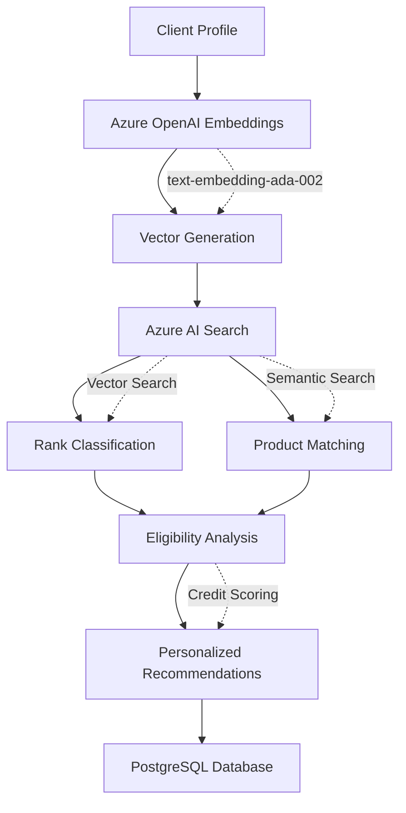

# Introducción

Credit Management API es un microservicio REST que proporciona capacidades avanzadas de gestión y evaluación de productos crediticios bancarios integrando servicios de Azure AI para implementar búsqueda semántica inteligente, análisis de perfiles crediticios y recomendaciones personalizadas basadas en similitud vectorial.

# Tecnologías

- Java 21
- Spring Boot 3.5.7
- Spring WebFlux
- Spring Data JPA
- PostgreSQL
- Liquibase
- MapStruct 1.5.5.Final
- Lombok
- Azure AI Search SDK 11.6.0
- Azure OpenAI SDK 1.0.0-beta.7
- Hypersistence Utils 3.6.0

# Componentes Azure AI

La aplicación utiliza Azure AI Search para búsqueda vectorial semántica de productos crediticios y Azure OpenAI para generar embeddings de alta calidad. El sistema mantiene índices especializados para rangos crediticios y productos financieros, permitiendo búsquedas semánticas que van más allá de coincidencias exactas mediante vectores de similitud.



# Funcionalidades

- Gestión completa de productos crediticios con operaciones CRUD y sincronización automática
- Administración de rangos crediticios con generación de embeddings semánticos
- Búsqueda vectorial avanzada para matching de productos basado en similitud contextual
- Evaluación crediticia integral con análisis de perfiles de clientes
- Recomendaciones personalizadas de productos financieros mediante IA
- Sincronización automática con Azure AI Search para búsquedas en tiempo real
- Clasificación automática de perfiles crediticios mediante vectores de similitud

Para detalles específicos de los endpoints y esquemas de datos, consultar la especificación OpenAPI en [specs/credit-management.yaml](../specs/credit-management.yaml).

# Ejecutar Localmente

## Requisitos Previos
- Java 21
- PostgreSQL 14+
- Azure AI Search service
- Azure OpenAI Service con modelo de embeddings desplegado

## Configuración
```bash
# Variables de entorno requeridas
export AZURE_SEARCH_ENDPOINT=https://your-search-service.search.windows.net
export AZURE_SEARCH_KEY=your_ai_search_admin_key
export AZURE_SEARCH_RANKS_INDEX=ranks-index
export AZURE_SEARCH_PRODUCTS_INDEX=products-index
export AZURE_OPENAI_ENDPOINT=your_azure_openai_endpoint
export AZURE_OPENAI_KEY=your_azure_openai_api_key
export AZURE_OPENAI_EMBEDDING_MODEL=text-embedding-ada-002
export DB_HOST=localhost
export DB_USERNAME=postgres
export DB_PASSWORD=your_password
```

## Ejecución
```bash
cd credit-management-api
./gradlew bootRun
```

La aplicación estará disponible en http://localhost:8080

## Colección Postman

Para facilitar las pruebas de la API, se proporciona una colección de Postman con todos los endpoints configurados en [postman/credit-management-v1.1.0.postman_collection.json](../postman/credit-management-v1.1.0.postman_collection.json).

# Referencias

- [Azure AI Search Documentation](https://docs.microsoft.com/en-us/azure/search/)
- [Azure AI Search REST API](https://docs.microsoft.com/en-us/rest/api/searchservice/)
- [Azure OpenAI Embeddings Guide](https://docs.microsoft.com/en-us/azure/cognitive-services/openai/how-to/embeddings)
- [Vector Search in Azure AI Search](https://docs.microsoft.com/en-us/azure/search/vector-search-overview)
- [Spring Boot Async Configuration](https://spring.io/guides/gs/async-method/)

```
credit-management-api/
├── src/main/java/
│   └── com/geniatonifs/creditmanagement/
│       ├── config/
│       │   └── AsyncConfig.java           # Configuración async para AI Search
│       ├── document/
│       │   ├── ProductDocument.java       # Entidad para Azure AI Search
│       │   └── ProductDocumentMapper.java # Mapper con embeddings OpenAI
│       ├── entity/
│       │   └── CreditProduct.java         # Entidad JPA
│       ├── listener/
│       │   └── ProductSyncListener.java   # ✨ SYNC AUTOMÁTICO AI SEARCH
│       └── search/
│           └── ProductSearchClient.java   # Cliente Azure AI Search
├── scripts/
│   ├── create-products.sh                 # Script para crear productos via API
│   └── test-ai-search-sync.sh             # Script de prueba de sincronización
└── src/main/resources/
    └── db/changelog/
        └── data.sql                       # Migración de datos actualizada
```

## 🔧 Configuración

### Variables de Entorno
```bash
# Azure AI Search
AZURE_SEARCH_ENDPOINT=https://tu-search-service.search.windows.net
AZURE_SEARCH_KEY=tu-api-key

# OpenAI para embeddings
OPENAI_API_KEY=tu-openai-key
```

### Thread Pool Asíncrono
- **Executor**: `aiSearchSyncExecutor`
- **Core Threads**: 5
- **Max Threads**: 10
- **Queue Capacity**: 100

## 🎯 Uso

### 1. Crear Productos (Sincronización Automática)
```bash
# Crear todos los productos del banco
./create-products.sh

# Probar sincronización con producto de prueba  
./test-ai-search-sync.sh
```

### 2. Verificar Sincronización
Los logs mostrarán:
```
🚀 Product inserted, starting AI Search indexing for productId: XXXX
✅ Product XXXX successfully indexed in AI Search with index result: IndexingResult{key='XXXX', isSucceeded=true}
```

### 3. API Endpoints
```bash
# Crear producto (sincroniza automáticamente)
POST /products
Content-Type: application/json

{
  "id": "CREDITO-PERSONAL-001",
  "name": "Crédito Personal Rápido",
  "description": "Crédito personal...",
  // ... resto de campos
}
```

## 🔍 Flujo de Sincronización

1. **Crear Producto** → API POST `/products`
2. **JPA Insert** → Guardar en PostgreSQL 
3. **ProductSyncListener** → `@PostPersist` activado automáticamente
4. **Conversión** → `ProductDocumentMapper.toProductDocument()` 
5. **Embeddings** → OpenAI genera vectores semánticos
6. **Indexación** → `ProductSearchClient.uploadDocuments()` a Azure AI Search
7. **Logs** → Confirmación con emojis 🚀 ✅

## ⚠️ Importante

- **Solo INSERT**: La sincronización solo ocurre al crear productos nuevos
- **Asíncrono**: No bloquea la respuesta de la API
- **Embeddings**: Se generan automáticamente para búsquedas semánticas
- **Error Handling**: Fallos en AI Search no afectan la creación del producto

## 🧪 Testing

```bash
# Probar creación de productos
./create-products.sh

# Probar sincronización específica
./test-ai-search-sync.sh

# Verificar logs para confirmación
tail -f logs/application.log | grep -E "🚀|✅"
```

## 📊 Monitoreo

### Logs Importantes
- `🚀 Product inserted` - Inicio de sincronización
- `✅ Product successfully indexed` - Sincronización exitosa  
- `❌ Error indexing product` - Error en sincronización

### Métricas
- **Thread Pool**: Monitorear `aiSearchSyncExecutor`
- **Azure AI Search**: Verificar índice de productos
- **OpenAI**: Monitorear uso de API para embeddings