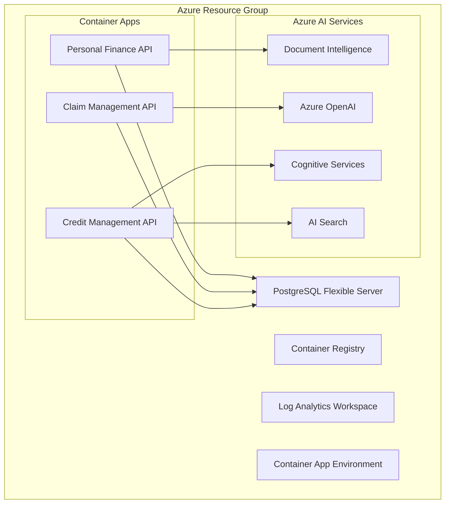

# 🏦 GENIA TON IFS - Azure AI Showcase Infrastructure

Infraestructura como código (IaC) con Terraform para desplegar un ecosistema completo de APIs de IA financiera en Azure Container Apps, integrado con servicios de Azure AI y base de datos PostgreSQL.

## 🏗️ Arquitectura del Sistema



### Componentes Principales

- **🌐 3 APIs Microservicios**: Personal Finance, Claim Management, Credit Management
- **🐘 PostgreSQL Flexible Server**: Base de datos compartida con 3 schemas independientes
- **🤖 Azure AI Services**: Document Intelligence, OpenAI, Cognitive Services, AI Search
- **📦 Azure Container Registry**: Almacenamiento seguro de imágenes Docker
- **🔍 Log Analytics**: Monitoreo centralizado y observabilidad

## 🚀 Despliegue Rápido

### Prerequisitos

1. **Azure CLI**: Autenticado y configurado
2. **Terraform**: v1.5+ instalado
3. **Suscripción Azure**: Con permisos de Contributor

### Configuración de Seguridad (REQUERIDO)

```bash
# 1. Configurar variables de entorno sensibles
cp main.env.example main.env

# 2. Editar main.env con tus valores reales
vim main.env  # O tu editor preferido

# 3. Cargar variables de entorno
source main.env
```

### Despliegue con Script Automatizado

```bash
# Despliegue completo en dev
./deploy.sh dev init  # Primera vez
./deploy.sh dev apply # Despliegue

# O en una sola línea
./deploy.sh dev
```

### Verificación del Despliegue

```bash
# Verificar recursos creados
az containerapp list --query "[].{Name:name,URL:properties.configuration.ingress.fqdn}" -o table

# Verificar base de datos
az postgres flexible-server list -o table
```

## 📁 Estructura del Proyecto

```
infra/
├── main.tf                     # 🏗️ Configuración principal
├── variables.tf                # 📝 Definiciones de variables
├── outputs.tf                  # 📤 Salidas del deployment
├── providers.tf                # ⚙️ Configuración de providers
├── deploy.sh                   # 🚀 Script de despliegue automático
├── main.env.example           # 🔒 Plantilla de variables sensibles
├── main.env                   # 🔐 Variables sensibles (gitignored)
├── environments/
│   └── dev.tfvars.json        # 🌍 Configuración por ambiente
└── modules/                   # 🧩 Módulos reutilizables
    ├── resource_group/
    ├── container_registry/
    ├── log_analytics_workspace/
    ├── container_app_environment/
    ├── container_app_instance/
    └── postgresql_flexible_server/
```

## ⚙️ Configuración Avanzada

### Variables de Ambiente

| Variable | Descripción | Por Defecto | Requerido |
|----------|-------------|-------------|-----------|
| `environment` | Ambiente (dev/staging/prod) | `"dev"` | ✅ |
| `location` | Región de Azure | `"westus"` | ✅ |
| `project_name` | Nombre del proyecto | `"mcp-app"` | ✅ |
| `postgres_administrator_password` | Contraseña PostgreSQL | - | ✅ |
| `document_intelligence_key` | Azure Document Intelligence | `""` | 🟡 |
| `open_ai_endpoint` | Azure OpenAI Endpoint | `""` | 🟡 |
| `cognitive_services_key` | Azure Cognitive Services | `""` | 🟡 |
| `ai_search_endpoint` | Azure AI Search | `""` | 🟡 |

> ✅ = Obligatorio | 🟡 = Opcional (según API que uses)

### Configuración de Recursos por Container

```json
{
  "container_cpu": 0.25,
  "container_memory": "0.5Gi", 
  "min_replicas": 1,
  "max_replicas": 10,
  "app_port": 8080,
  "external_access": true
}
```

## 🔐 Gestión de Secretos

### Variables Sensibles

Todas las variables sensibles se manejan a través de variables de entorno con el prefijo `TF_VAR_`:

```bash
# PostgreSQL
export TF_VAR_postgres_administrator_password="YourSecurePassword123!"

# Azure AI Services
export TF_VAR_document_intelligence_key="your-doc-intel-key"
export TF_VAR_open_ai_key="your-openai-key" 
export TF_VAR_cognitive_services_key="your-cognitive-key"
export TF_VAR_ai_search_key="your-search-key"
```

### Buenas Prácticas de Seguridad

- ✅ Archivo `main.env` está en `.gitignore`
- ✅ Variables marcadas como `sensitive = true` en Terraform
- ✅ Contraseñas con validación de complejidad
- ✅ Firewalls configurados para acceso desde Azure únicamente

## 🎯 APIs Desplegadas

### 1. Personal Finance API (`/personal-finance`)
- **Puerto**: 8080
- **Servicios**: Document Intelligence para procesamiento de documentos
- **Base de Datos**: `personal_finance` schema

### 2. Claim Management API (`/claim-management`) 
- **Puerto**: 8080
- **Servicios**: Azure OpenAI para análisis de claims
- **Base de Datos**: `claim_management` schema

### 3. Credit Management API (`/credit-management`)
- **Puerto**: 8080 
- **Servicios**: Cognitive Services + AI Search para scoring crediticio
- **Base de Datos**: `credit_management` schema

## 📊 Monitoreo y Observabilidad

### Logs Centralizados
```bash
# Ver logs en tiempo real
az containerapp logs show --name personal-finance-api --resource-group <rg-name> --follow

# Logs de todas las apps
az containerapp list | jq -r '.[] | .name' | xargs -I {} az containerapp logs show --name {} --resource-group <rg-name>
```

### Métricas en Azure Portal
- **Application Insights**: Telemetría automática
- **Log Analytics**: Queries KQL personalizadas
- **Container Apps**: Métricas de CPU, memoria, requests

## 🛠️ Operaciones Comunes

### Escalado Manual
```bash
# Escalar una app específica
az containerapp update --name personal-finance-api --resource-group <rg-name> --min-replicas 2 --max-replicas 20
```

### Actualizar Imagen
```bash
# Build y deploy nueva versión
az acr build --registry <acr-name> --image personal-finance-api:v1.1.0 ../personal-finance-api/
az containerapp update --name personal-finance-api --image <acr-name>.azurecr.io/personal-finance-api:v1.1.0
```

### Backup de Base de Datos
```bash
# Crear backup automático (ya configurado en PostgreSQL Flexible Server)
az postgres flexible-server backup list --resource-group <rg-name> --server-name <server-name>
```

## 🧹 Limpieza de Recursos

```bash
# Destruir toda la infraestructura
./deploy.sh dev destroy

# O manualmente
terraform destroy -var-file="environments/dev.tfvars.json"
```

## 🚨 Troubleshooting

### Errores Comunes

1. **Container Registry Login Failed**
   ```bash
   az acr login --name <acr-name>
   ```

2. **PostgreSQL Connection Issues**
   - Verificar firewall rules en Azure Portal
   - Confirmar credenciales en variables de entorno

3. **Container Apps No Responden**
   ```bash
   # Verificar health status
   az containerapp show --name <app-name> --resource-group <rg-name> --query "properties.runningStatus"
   ```

### Logs de Debug

```bash
# Habilitar logs detallados
export TF_LOG=DEBUG
terraform plan -var-file="environments/dev.tfvars.json"
```

## 📚 Recursos Adicionales

- [Azure Container Apps Docs](https://docs.microsoft.com/en-us/azure/container-apps/)
- [PostgreSQL Flexible Server](https://docs.microsoft.com/en-us/azure/postgresql/flexible-server/)
- [Azure AI Services](https://docs.microsoft.com/en-us/azure/cognitive-services/)
- [Terraform Azure Provider](https://registry.terraform.io/providers/hashicorp/azurerm/latest/docs)

---

**Estado del Proyecto**: ✅ Producción Ready | **Última Actualización**: Noviembre 2024