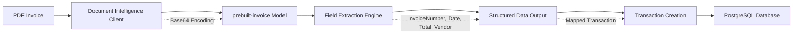

# Introducción

Personal Finance API es un microservicio REST que permite la gestión integral de finanzas personales mediante el registro de transacciones, categorización de gastos e ingresos, y procesamiento automático de facturas utilizando inteligencia artificial para la extracción de datos estructurados.

# Tecnologías

- Java 21
- Spring Boot 3.5.7
- Spring WebFlux
- Spring Data JPA
- PostgreSQL
- Liquibase
- MapStruct 1.5.5.Final
- Lombok
- Azure Document Intelligence SDK 1.0.6
- Hibernate Types 2.21.1

# Componentes Azure AI

La aplicación utiliza Azure Document Intelligence para el procesamiento automático de facturas en formato PDF. El servicio emplea el modelo preentrenado "prebuilt-invoice" para extraer campos estructurados como número de factura, fecha, monto total, información del proveedor y líneas de productos mediante reconocimiento óptico de caracteres avanzado.



# Funcionalidades

- Gestión de categorías de gastos e ingresos para clasificación de transacciones
- Registro y consulta de transacciones financieras con validación de datos
- Procesamiento automático de facturas PDF mediante Azure Document Intelligence
- Extracción automática de datos estructurados de documentos (número, fecha, monto, proveedor)
- Generación de reportes mensuales categorizados con análisis de gastos e ingresos
- Soporte para múltiples formatos de archivo (PDF, JPEG, PNG, TIFF)

Para detalles específicos de los endpoints y esquemas de datos, consultar la especificación OpenAPI en [specs/personal-finance.yaml](../specs/personal-finance.yaml).

# Ejecutar Localmente

## Requisitos Previos
- Java 21
- PostgreSQL 14+
- Azure Document Intelligence resource

## Configuración
```bash
# Variables de entorno requeridas
export AZURE_DOCUMENT_INTELLIGENCE_KEY=your_key
export AZURE_DOCUMENT_INTELLIGENCE_ENDPOINT=your_endpoint
export DB_HOST=localhost
export DB_USERNAME=postgres
export DB_PASSWORD=your_password
```

## Ejecución
```bash
cd personal-finance-api
./gradlew bootRun
```

La aplicación estará disponible en http://localhost:8080

## Colección Postman

Para facilitar las pruebas de la API, se proporciona una colección de Postman con todos los endpoints configurados en [postman/personal-finance.postman_collection.json](../postman/personal-finance.postman_collection.json).

# Referencias

- [Azure Document Intelligence Documentation](https://docs.microsoft.com/en-us/azure/applied-ai-services/form-recognizer/)
- [Spring Boot WebFlux Guide](https://spring.io/guides/gs/reactive-rest-service/)
- [Spring Data JPA Reference](https://docs.spring.io/spring-data/jpa/docs/current/reference/html/)
- [Liquibase Documentation](https://docs.liquibase.com/)
- [MapStruct Reference Guide](https://mapstruct.org/documentation/stable/reference/html/)