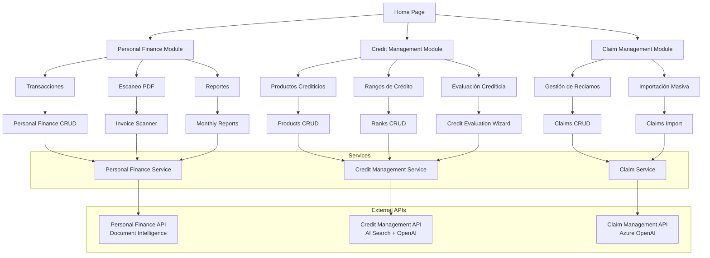

# Introducción

Showcase Website es una aplicación web frontend desarrollada con Angular 20 que sirve como interfaz de usuario para demostrar las capacidades de los servicios de Inteligencia Artificial de Azure a través de casos de uso financieros reales. La aplicación proporciona interfaces modernas e intuitivas para gestión de finanzas personales, evaluación crediticia y manejo de reclamos financieros, integrando servicios de Azure AI como Document Intelligence, OpenAI y AI Search.

# Tecnologías

| Tecnología | Versión | Propósito |
|------------|---------|-----------|
| Angular | 20.3.0 | Framework principal de desarrollo |
| TypeScript | 5.9.2 | Lenguaje de programación tipado |
| TailwindCSS | 4.1.13 | Framework de CSS utility-first |
| RxJS | 7.8.0 | Manejo de programación reactiva |
| Chart.js | 4.5.1 | Biblioteca de gráficos |
| ngx-markdown | 20.1.0 | Procesamiento de contenido Markdown |
| marked | 16.3.0 | Parser de Markdown |
| date-fns | 4.1.0 | Utilidades de manipulación de fechas |
| PostCSS | 8.5.6 | Procesador de CSS |
| Jasmine | 5.9.0 | Framework de testing |
| Karma | 6.4.0 | Test runner |

# Apis que consume

| API | Puerto Local | Documentación OpenAPI | Código Fuente |
|-----|-------------|-----------------------|---------------|
| Personal Finance API | 8080 | [personal-finance.yaml](../specs/personal-finance.yaml) | [personal-finance-api](../personal-finance-api) |
| Claim Management API | 8081 | [claim-management.yaml](../specs/claim-management.yaml) | [claim-management-api](../claim-management-api) |
| Credit Management API | 8082 | [credit-management.yaml](../specs/credit-management.yaml) | [credit-management-api](../credit-management-api) |

# Funcionalidades

La aplicación está organizada en tres módulos principales que consumen servicios de Azure AI para casos de uso financieros:

## Módulo Personal Finance
- Gestión de transacciones financieras personales
- Escaneo y análisis de facturas PDF mediante Document Intelligence
- Generación de reportes mensuales con visualización de gráficos
- Categorización automática de gastos

## Módulo Claim Management
- Gestión completa de reclamos financieros
- Importación masiva de reclamos desde archivos Excel
- Análisis automático de motivos y submotivos mediante Azure OpenAI
- Sistema de estados para seguimiento de reclamos

## Módulo Credit Management
- Gestión de catálogo de productos crediticios
- Administración de rangos de clasificación crediticia
- Evaluación automática de elegibilidad crediticia usando AI Search
- Sincronización automática con Azure AI Search para scoring



# Ejecutar Localmente

## Requisitos Previos
- Node.js 18 o superior
- npm 9 o superior
- Angular CLI 20 o superior

## Configuración

1. Clonar el repositorio y navegar al directorio del proyecto:
```bash
cd showcase-website
```

2. Instalar dependencias:
```bash
npm install
```

3. Configurar variables de entorno en `src/environments/environment.ts`:
```typescript
export const environment = {
  production: false,
  personalFinance: 'http://localhost:8080',
  claimManagement: 'http://localhost:8081', 
  creditManagement: 'http://localhost:8082',
  localization: {
    locale: 'es-PE',
    currency: 'PEN'
  }
};
```

4. Asegurar que las APIs backend estén ejecutándose en sus respectivos puertos antes de iniciar la aplicación.

## Ejecución

Iniciar el servidor de desarrollo:
```bash
npm start
```

La aplicación estará disponible en `http://localhost:4200`.

## Comandos Adicionales

- Construir para producción: `npm run build`
- Ejecutar tests: `npm test`
- Modo de desarrollo con watch: `npm run watch`
- Servir build de producción: `ng serve --configuration production`
